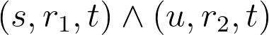
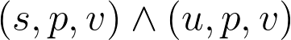
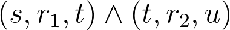

# Explanation Generation

We extract domain-specific and general knowledge from Attribute Graph and DBpedia, respectively.
* Attribute Graph are available at [here](../data/X_ZSL/AttributeGraph.json)
* DBpedia: we use online DBpedia query service, which loads DBpedia 2016-10 dump (more details at [here](https://wiki.dbpedia.org/public-sparql-endpoint))

Extract Knowledge from Attribute Graph
------
### Extract Common Attributes
Note that the ZSL classes are naturally aligned with entities in Attribute Graph,
we begin with extract common attributes between seen and unseen classes using association rule mining algorithm (i.e., Evidence Mining algorithm in our work).

We introduce the algorithm with some examples, the details are in `rule_mining.py`.

Extract Knowledge from DBpedia
------
### Match ZSL class with DBpedia Entity
We use [DBpedia Lookup service](https://github.com/DBpedia/lookup) to match, which is based on the index of DBpedia Spotlight.
You can refer to the script `wnid2entity.py`.

With matched entities, we manually remove the incorrect ones, the final results are provided in `'../data/X_ZSL/wnid-dbEntity.txt'`.

### Extract keywords from Abstract Text of DBpedia Entity
We first use the SPQRAL query to get abstract text of entity with the property **dbo:abstract**.
The query script is provided in `quert_abstract_text.py`.

Then, we use `gensim` toolkit to extract keywords of abstract text, which packages the TextRank algorithm.
At the same time, we label each keyword with a POS tag and a NER tag using [SpaCy](https://spacy.io/usage/linguistic-features).
More details are in `extract_and_tag_keywords.py`.

### Extract triples using SPARQL Query 
For extracting valid triples which describe the knowledge of seen and unseen classes, 
we design some triple patterns and transform them into SPARQL queries to query knowledge from DBpedia.

The code is in `query_triples.py`, we show the designed triple patterns and some queried results as follows.
#### Examples of Rule Patterns

Taking the following classes as examples.
* Unseen class *Crab* (*dbr:Crab*) and its impressive seen class *Fiddler crab* (*dbr:Fiddler_crab*).
* Unseen class *Indian mongoose* (*dbr:Small_Asian_mongoose*) and its impressive seen class *Mongoose* (*dbr:Mongoose*).
* Unseen class *Guanaco* (*dbr:Guanaco*) and its impressive seen class *Llama* (*dbr:Llama*).
* Unseen class *Smooth hammerhead* (*dbr:Smooth_hammerhead*) and its impressive seen class *Hammerhead shark* (*dbr:Hammerhead_shark*).
* Unseen class *Wood ant* (*dbr:Formica*) and its impressive seen class *Ant* (*dbr:Ant*).
* Unseen class *Guanaco* (*dbr:Guanaco*) and its impressive seen class *Llama* (*dbr:Llama*).

|Triple Pattern|Diagram|Examples|Illustration|
|----|-----|----|-----|
|||(*dbr:Fiddler_crab, dbo:order, dbr:Crab*)|*Fiddler crab* is directly related with *Crab* via relation *hypernym*.|
|||(*dbr:Small_Asian_mongoose, hypernym, dbr:Mongoose*)|*Indian mongoose* is directly related with *Mongoose* via relation *hypernym*.|
|||(*dbr:Guanaco, hypernym, dbr:Camelid*) &   (*dbr:Llama, hypernym, dbr:Camelid*)  (*dbr:Smooth_hammerhead, hypernym, dbr:Shark*) &   (*dbr:Hammerhead_shark, dbo:order, dbr:Shark*)|*Guanaco* and *Llama* are both the members of *Camelid*.      *Smooth hammerhead* and *Hammerhead shark* are both relevant to *Shark* via relation *hypernym* and *order*.|
|||(*dbr:Formica, dbp:typeSpecies, Formica rufa*) &  (*dbr:Ant, dbp:typeSpecies, Formica rufa*)|*Wood ant* and *Ant* both have property *species type* and share the same property value *Formica rufa*.|
|||(*dbr:Fiddler_crab, dbo:family, dbr:Ocypodidae*) & (*dbr:Ocypodidae, dbo:order, dbr:Crab*)|*Fiddler crab* and *Crab* is related via a transitional entity *Ocypodidae*.|

