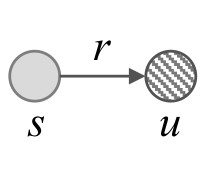
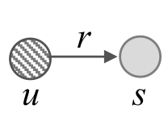
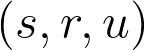
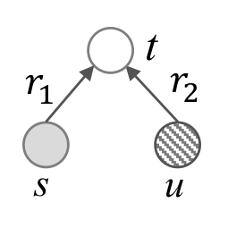
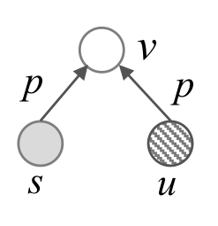
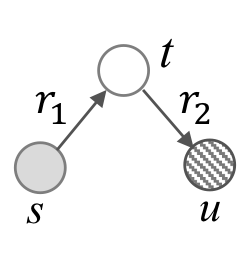

#### examples of rule pattern

Taking following classes as examples.
* Unseen class *Crab* (*dbr:Crab*) and its impressive seen class *Fiddler crab* (*dbr:Fiddler_crab*).
* Unseen class *Indian mongoose* (*dbr:Small_Asian_mongoose*) and its impressive seen class *Mongoose* (*dbr:Mongoose*).
* Unseen class *Guanaco* (*dbr:Guanaco*) and its impressive seen class *Llama* (*dbr:Llama*).
* Unseen class *Smooth hammerhead* (*dbr:Smooth_hammerhead*) and its impressive seen class *Hammerhead shark* (*dbr:Hammerhead_shark*).
* Unseen class *Wood ant* (*dbr:Formica*) and its impressive seen class *Ant* (*dbr:Ant*).
* Unseen class *Guanaco* (*dbr:Guanaco*) and its impressive seen class *Llama* (*dbr:Llama*).

|Triple Pattern|Diagram|Examples|Illustration|
|----|-----|----|-----|
|$ (s, r, u)$||(*dbr:Fiddler_crab, dbo:order, dbr:Crab*)|*Fiddler crab* is directly related with *Crab* via relation *hypernym*.|
|$(u, r, s)$||(*dbr:Small_Asian_mongoose, hypernym, dbr:Mongoose*)|*Indian mongoose* is directly related with *Mongoose* via relation *hypernym*.|
|||(*dbr:Guanaco, hypernym, dbr:Camelid*) &   (*dbr:Llama, hypernym, dbr:Camelid*)  (*dbr:Smooth_hammerhead, hypernym, dbr:Shark*) &   (*dbr:Hammerhead_shark, dbo:order, dbr:Shark*)|*Guanaco* and *Llama* are both the members of *Camelid*.     *Smooth hammerhead* and *Hammerhead shark* are both relevant to *Shark* via relation *hypernym* and *order*.|
|$(s, p, v) \wedge (u, p, v)$||(*dbr:Formica, dbp:typeSpecies, Formica rufa*) &  (*dbr:Ant, dbp:typeSpecies, Formica rufa*)|*Wood ant* and *Ant* both have property *species type* and share the same property value *Formica rufa*.|
|$$ (s, r_1, t) \wedge (t, r_2, u)$$||(*dbr:Fiddler_crab, dbo:family, dbr:Ocypodidae*) & (*dbr:Ocypodidae, dbo:order, dbr:Crab*)|*Fiddler crab* and *Crab* is related via a transitional entity *Ocypodidae*.|

